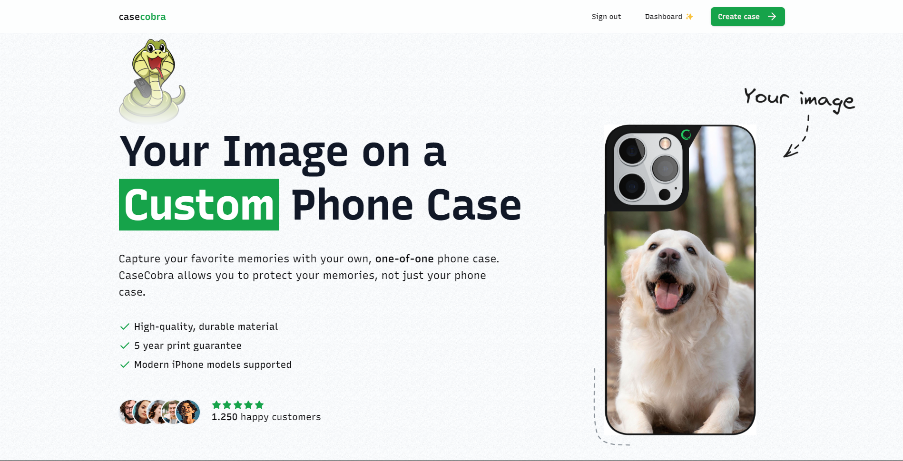

# CaseCobra - Design Your Custom Phone Cases

CaseCobra is an innovative e-commerce web app where users can create and purchase personalized phone cases using their uploaded images. The platform combines functionality with an elegant, smooth user experience, making the process enjoyable and seamless.

## Technologies Used

- ⚛️ **Next.js 14**: A robust React framework for modern web development.
- 🎨 **Shadcn**: Pre-designed, reusable components for stunning interfaces.
- 🗄️ **Prisma**: A modern ORM for database management and efficient data handling.
- 🔄 **React Query**: Simplified data fetching and state management for an optimized experience.
- 🗺️ **React Router**: Seamless navigation and routing across the app.
- 🎥 **TailwindCSS**: A utility-based CSS framework used to craft smooth, custom animations and responsive designs.

## Key Features

- 🌐 Built entirely with Next.js 14
- 🎨 Elegant landing page with a sleek and intuitive design
- 🛍️ Comprehensive e-commerce functionality, including product customization and online purchasing
- 🔒 Admin dashboard for order management
- 📂 Drag-and-drop file upload system
- 🛒 Fully customizable phone case configurator with live previews
- 🔑 User authentication powered by Kinde
- ✉️ Personalized thank-you emails for customers
- 💡 Tailwind-powered animations were custom-made to enhance the interactivity and polish of the UI
- 🖋️ 100% TypeScript for enhanced reliability

CaseCobra offers a complete and immersive e-commerce solution, empowering users to express their creativity while enjoying a delightful shopping experience.
